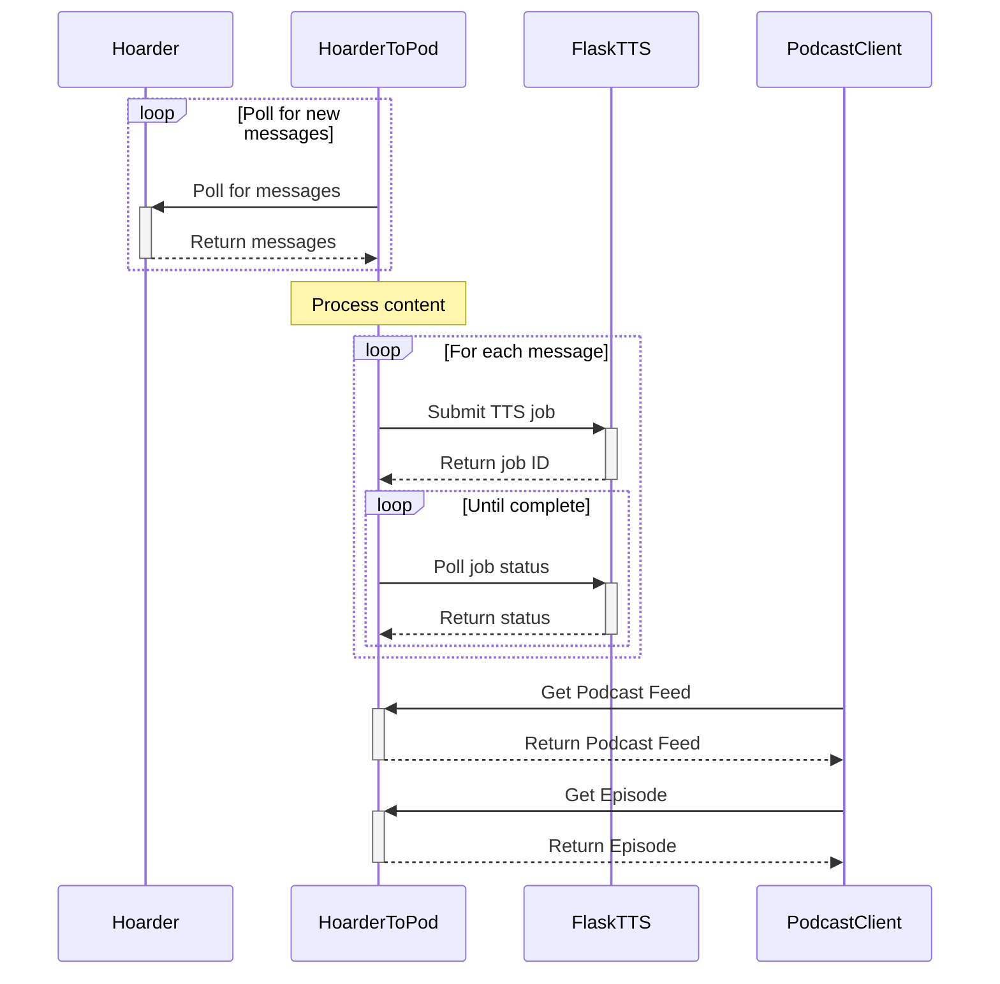

# HoarderToPod
Get all of your hoardered articles as a podcast.

Still pretty beta and rough around the edges but I've been using it daily for a month now. (PRs welcome)

Poll for new messages from [hoarder](https://github.com/hoarder-app/hoarder) and process them using [FlaskTTS](https://github.com/DerekParks/FlaskTtS/) to generate the audio.

## Docker installation (recommended)

1. Get the compose file:
```bash
mkdir HoarderToPod && cd HoarderToPod
wget https://raw.githubusercontent.com/DerekParks/HoarderToPod/refs/heads/main/docker-compose.yaml
```
1b. Uncomment the FlaskTTS service section if you haven't already setup FlaskTTS.

2. Set the environment variables in the .env file. See sample.env for an example.

3. Run the compose file:
```bash
docker compose up
```


## Development

### Sequence Diagram




To run the web service locally:
```bash
pip install -r requirements.txt # create a virtual environment first if you want
FLASK_ENV=dev python hoarderpod/api.py
```

To run the worker
```bash
python hoarderpod/run.py
```

## Roadmap (Todo)
- Tests, I added a few but more coverage especially around scraping/parsing
- Better scaping and html to text conversion
- Add some CSS to the UI
- Get done notifications from FlaskTTS instead of polling
- Add a web interface for managing episodes (Kind of exists now but could be better)
